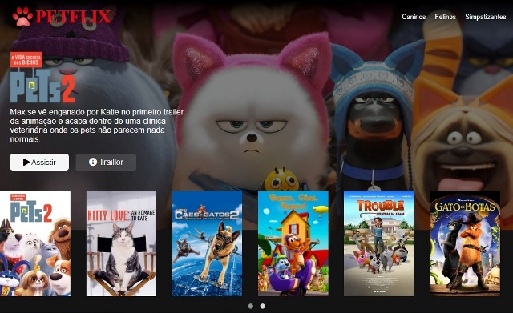

<h1 align="center">
  
  PETFLIX
</h1>

 Status <☕>Finalizado<☕/> HTML | CSS | JavaScript 

# Desafio DIO | Bootcamp HTML Web Developer | Clone Netflix | Março 2022

### Descrição

- [x] Recriar e reconceitualizar uma das interfaces interativas da Netflix com responsividade.

## 📁 Acessibilidade:

- Para ler os códigos fonte, basta acessá-los diretamente nesse repositório.     

- Para acessar a page, clique na imagem abaixo com o *scroll* ou com o botão direito do mouse para abrir em nova aba:

## :hammer_and_wrench: Tecnologias Utilizadas:

- *HTML5* : estrutura da page & linkagem.

- *CSS3* : técnicas de estilização do layout.

- *JavaScript* : algoritmos.

- *jQuery* & *Bootstrap* : frameworks javaScript e CSS.

- *FlexBox* & *OwlCarousel* : plugins para manipulação de elementos.

- *Git* & *GitHub* : deployer e repositório.

- *VSCode* : IDE. 

O desafio levou 3 dias de execução entre: passo-a-passo da aula, adaptações da interface e refatoração.

## :octocat: A Autora: 

<table>
  <tr>
    <td align="center">
      <a href="#">
         
        
          <b>Debh Valois</b>
        
      </a>
    </td>
  </tr>
</table>

